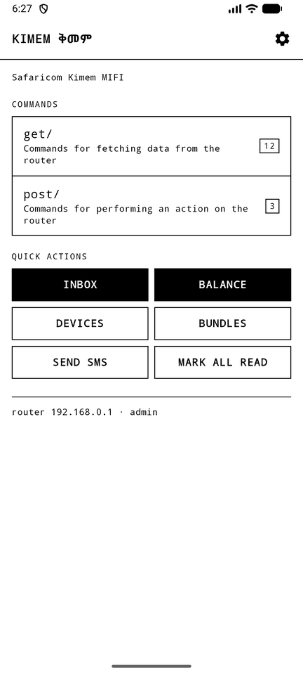
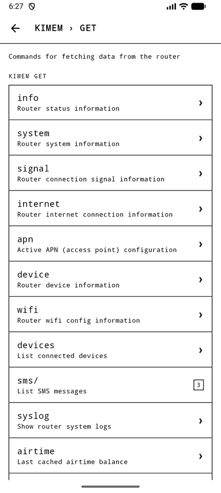
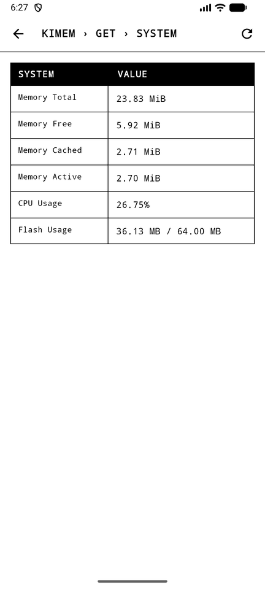
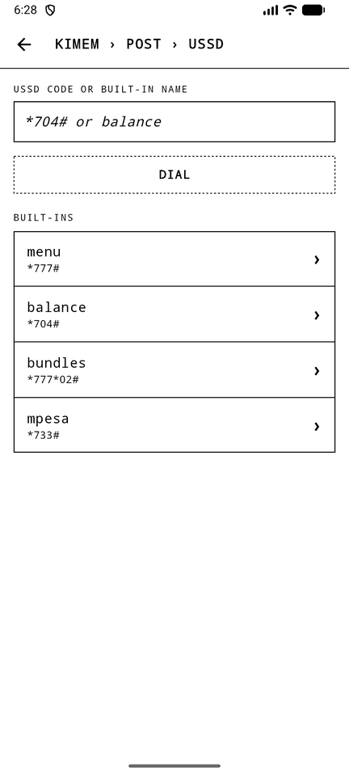
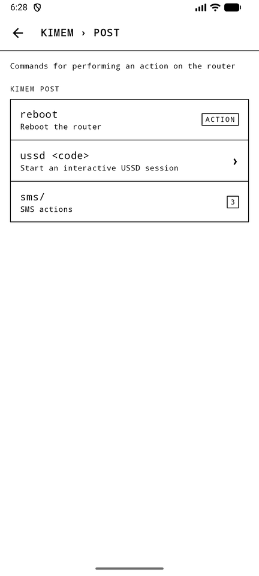
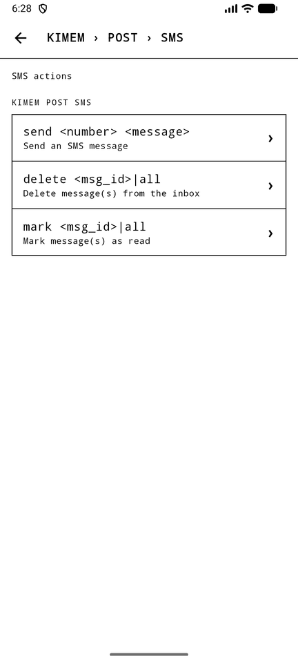
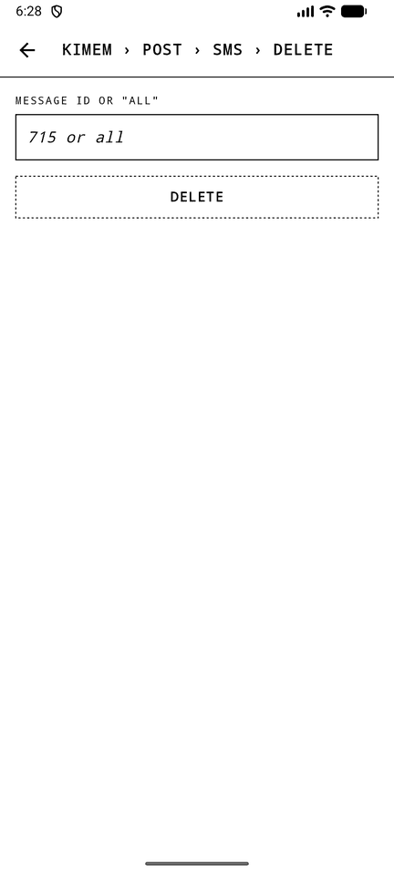
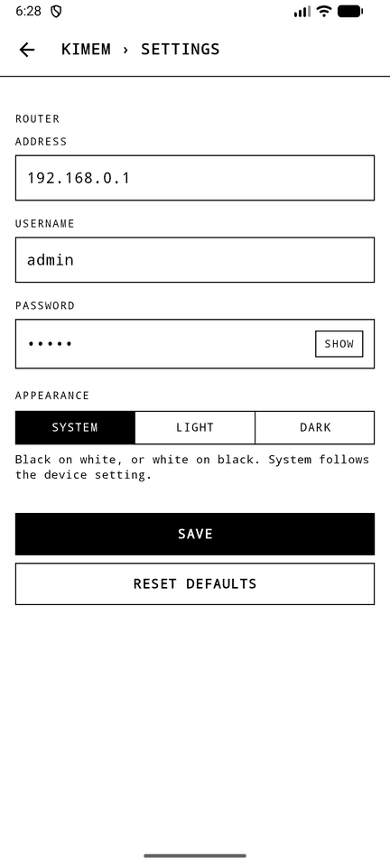
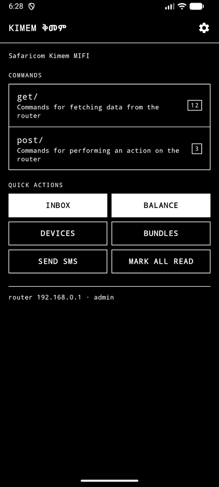
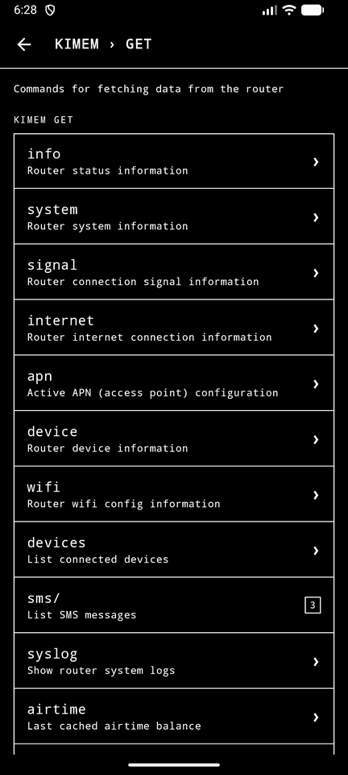

# Kimem (ቅመም) for Android

A port of [frectonz/kimem](https://github.com/frectonz/kimem), the Safaricom
Kimem MIFI CLI, to Android.

## Screenshots

  
  
  
  

  
  
  
  

Dark mode:

  
  

